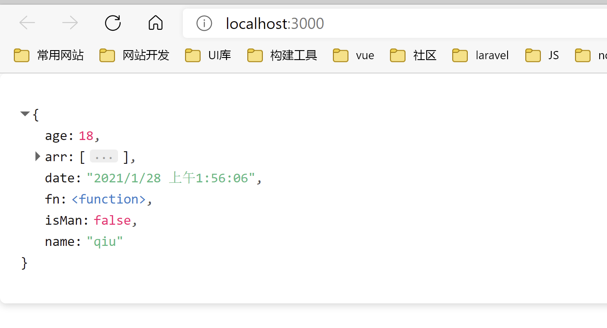

# vue3-json-viewer

[中文版](readme_cn.md)

Simple and easy-to-use json content display component suitable for `vue3` and `vite`.
When developing with `vue3`+`vite`, I found that I needed to use the display json data component, and found that `vue-json-viewer` can only be compatible with `vue2`, so it took an hour to rewrite the adaptation of `vue3`.
Original author: [github](https://github.com/chenfengjw163/vue-json-viewer)

## Install

Requires `clipboard`

```
$ npm install clipboard --save
```

Then install `vue3-json-viewer`

```
$ npm install vue3-json-viewer --save
```

## RecentUpdate
- dark theme support
- Add click event for keyNode
- Support RegExp types

## Doc
> [document](https://vjv-doc-qiuquanwu.vercel.app/)
## Usage

main.js

```js
import { createApp } from "vue";
import App from "./App.vue";
import JsonViewer from "vue3-json-viewer";
// if you used v1.0.5 or latster ,you should add import "vue3-json-viewer/dist/index.css"
import "vue3-json-viewer/dist/vue3-json-viewer.css";
const app = createApp(App);
app.use(JsonViewer);
app.mount("#app");
```

App.vue

``` html
<template>
  <div class="box">
    <h4>Light</h4>
    <JsonViewer :value="jsonData" copyable boxed sort theme="light"  @onKeyClick="keyClick"/>
    <h4>Dark</h4>
    <JsonViewer :value="jsonData" copyable boxed sort theme="dark"  @onKeyClick="keyClick"/>
  </div>
</template>

<script setup>
import {JsonViewer} from "vue3-json-viewer"
// if you used v1.0.5 or latster ,you should add import "vue3-json-viewer/dist/index.css"
import "vue3-json-viewer/dist/vue3-json-viewer.css";
import { reactive, ref } from "vue";
let obj = {
  name: "qiu",//string
  age: 18,//Array
  isMan:false,//boolean
  date:new Date(),
  fn:()=>{},
  arr:[1,2,5],
  reg:/ab+c/i
};
const jsonData = reactive(obj);
const keyClick = (keyName)=>{
  console.log(keyName,"it was click")
}
</script>

<style>
.box{
  margin-top: 1rem;
}
</style>


```


